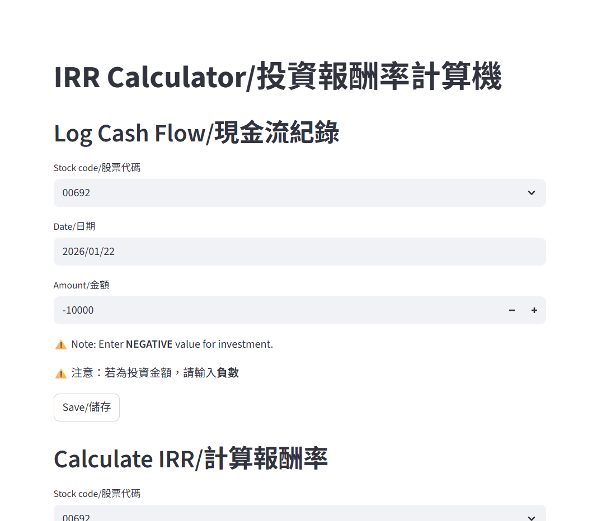
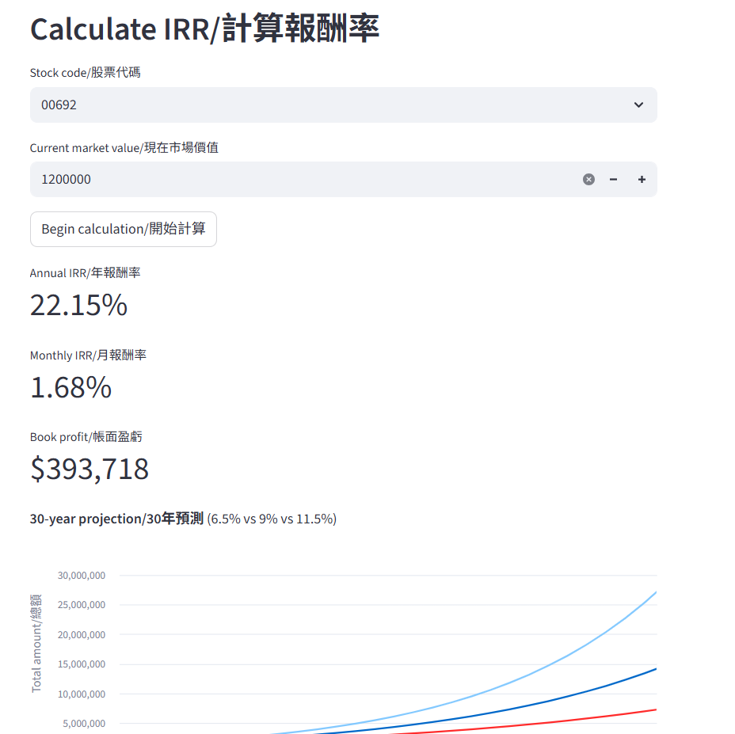

[Scroll down for English version.]

# IRR Calculator / 投資報酬率計算機

## 簡介

我的個人 Streamlit 應用程式，用於追蹤投資現金流並計算股票持倉的內部報酬率（IRR）。

### 功能特色

- **現金流紀錄**: 記錄投資交易的日期和金額
- **IRR 計算**: 使用 XIRR 方法計算年化和月化內部報酬率
- **帳面盈虧**: 根據目前市場價值追蹤總損益
- **30年預測**: 在三種情境下（6.5%、9%、11.5% 年報酬率）視覺化呈現潛在投資成長
- **交易歷史**: 查看所有記錄的交易

### 使用說明

- 投資金額請使用**負數**（資金流出）
- 提款或股利請使用正數
- 計算 IRR 需要輸入目前市場價值

### 技術堆疊

- Streamlit
- SQLite
- pyxirr (XIRR 計算)
- pandas

### 免責聲明

個人投資追蹤工具，非財務建議。

---

## Introduction

My personal Streamlit app for tracking investment cash flows and calculating Internal Rate of Return (IRR) for stock holdings.

### Features

- **Cash Flow Logging**: Record investment transactions with dates and amounts
- **IRR Calculation**: Calculate both annual and monthly Internal Rate of Return using the XIRR method
- **Book Profit**: Track total gains/losses based on current market value
- **30-Year Projection**: Visualize potential investment growth under three scenarios (6.5%, 9%, 11.5% annual returns)
- **Transaction History**: View all logged transactions

### Usage Notes

- Use **negative values** for investments (money out)
- Use positive values for withdrawals or dividends
- Current market value is required for IRR calculation

### Tech Stack

- Streamlit
- SQLite
- pyxirr (for XIRR calculations)
- pandas

### Disclaimer

Personal tool for tracking my own investments. Not financial advice.

