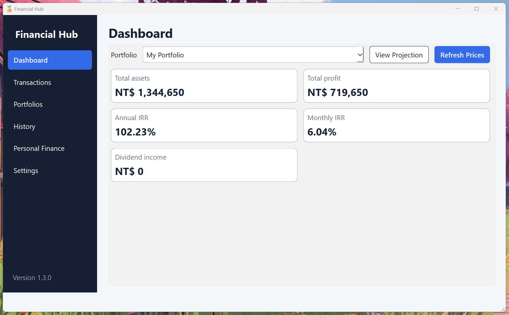
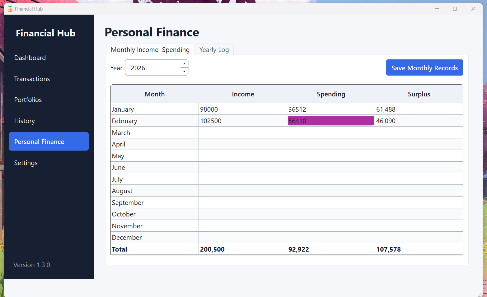
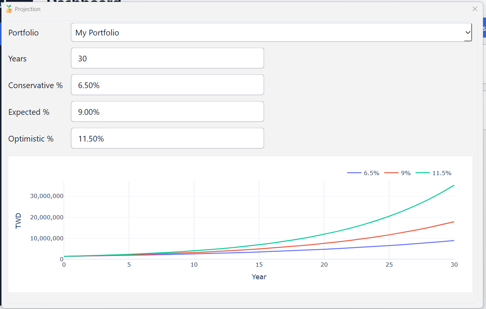

# Financial Hub

[](https://github.com/HankTaiwan869/Personal-Finance-Manager/actions/workflows/ci.yml)

Financial Hub is a local PyQt desktop application for tracking Taiwan securities and personal finances. It combines portfolio activity, investment returns, compound-growth projections, monthly cash flow, and annual net-worth snapshots in a local SQLite database.

I built it to replace parts of my own spreadsheet-based workflow and to learn software engineering through a project I actually use. Its scope is intentionally personal.

## Screenshots

The main application views are shown below.

| Dashboard | Personal Finance | Projection |
| --- | --- | --- |
|  |  |  |

## Key features

- Manage multiple portfolios and record buys, sells, dividends, opening positions, and share reconciliations.
- Reconstruct holdings from transaction history and calculate market value, profit, dividend income, annual XIRR, and an equivalent monthly return.
- Refresh Taiwan security metadata and delayed daily closes through FinMind.
- Explore three adjustable compound-growth scenarios in an interactive Plotly chart.
- Search, sort, edit, and delete transaction history; archive portfolios without including them in combined active-portfolio results.
- Record monthly income and spending plus manual annual asset, investment, debt, and net-worth snapshots.
- Back up the live SQLite database and explicitly import legacy Excel or SQLite cash-flow records.
- Store the FinMind token in the operating-system keyring rather than the application database.

## Engineering highlights

### Ledger and financial semantics

Holdings are derived by replaying transactions in date-and-ID order instead of maintaining a mutable share balance. Inserts, edits, and deletes are rejected if they would make a holding negative at any point in its history.

Transaction types encode both share movement and owner cash flow. For example, a paid dividend is income, while a reinvested dividend adds shares with no external cash flow. This distinction feeds portfolio profit and XIRR calculations without double-counting internal activity.

### Numeric handling

Share quantities and transaction amounts are stored as whole integers. Quote prices, market values, and projection calculations retain `Decimal` values; TWD values are rounded half-up only for display. Conversion to floating point is deferred until the `pyxirr` API boundary.

### Layered application design

PyQt widgets handle interaction, service modules enforce rules and perform calculations, SQLAlchemy models define persistence, and a provider protocol separates market-data access from the rest of the application. The same transaction service is used by normal entry, editing, and legacy imports.

### Responsive and defensive I/O

FinMind synchronization, connection tests, and quote refreshes run through Qt's thread pool so network requests do not freeze the interface. Refreshes prevent overlap, isolate failures per security, preserve existing quotes after errors, and redact API tokens from provider messages.

SQLite foreign keys, uniqueness rules, check constraints, indexes, and explicit schema validation protect local data. Backups use SQLite's online backup API.

## Architecture

```text
PyQt views and dialogs
        |
        v
Application services  <---->  Provider interface  <---->  FinMind API
        |
        v
SQLAlchemy models
        |
        v
Local SQLite database
```

```text
financial_hub/
|-- ui/             # Main window, feature views, dialogs, table models, workers
|-- services/       # Transactions, analytics, quotes, personal-finance rules
|-- providers/      # Provider contract and FinMind HTTP implementation
|-- models.py       # SQLAlchemy entities and database constraints
|-- database.py     # Engine setup, schema checks, sessions, and backup
`-- data_import.py  # Legacy cash-flow import pipeline

scripts/            # One-time Personal Finance migration/import helpers
tests/              # Service, persistence, provider, and GUI regression tests
```

A transaction moves from a form into the service layer for normalization and ledger validation before SQLAlchemy persists it. Dashboard and projection views ask the analytics service to replay that history, select the latest eligible quotes, and derive the displayed results.

## Tech stack

| Area | Technology |
| --- | --- |
| Language and packaging | Python 3.11+, `uv` |
| Desktop UI | PyQt6, Qt WebEngine |
| Persistence | SQLite, SQLAlchemy 2 |
| Market data | HTTPX, FinMind API |
| Analytics and charts | `pyxirr`, `Decimal`, Plotly |
| Credentials | `keyring` |
| Testing and CI | pytest, pytest-qt, Ruff, GitHub Actions |

## Install and run

The project is developed primarily for Windows. Install [uv](https://docs.astral.sh/uv/), then run:

```powershell
git clone https://github.com/HankTaiwan869/Personal-Finance-Manager.git
cd Personal-Finance-Manager
uv sync --dev
uv run financial-hub
```

The development entry point is equivalent:

```powershell
uv run python main.py
```

`run.bat` is also available as a Windows convenience launcher.

On first launch, the application creates a default portfolio and database, then downloads the FinMind security master in the background. Save a FinMind token under **Settings** before manually synchronizing securities or refreshing prices. The token is stored through `keyring` (Windows Credential Manager on the primary development platform).

Application data is stored at:

```text
%LOCALAPPDATA%\IRRCalculator\financial-hub.sqlite3
```

## Testing

```powershell
uv run ruff check .
uv run pytest
```

The test suite uses temporary SQLite databases, mocked HTTP transports/providers, and `pytest-qt`. It exercises the areas where regressions would materially affect results or usability:

- transaction signs, validation, backdated edits, and non-negative holdings;
- ledger replay, decimal valuation, dividends, XIRR edge cases, and projection math;
- quote updates, retry behavior, provider errors, database constraints, backup, and import/migration paths;
- PyQt navigation, form behavior, view coordination, sorting, styling, lazy chart loading, and background work.

GitHub Actions runs Ruff and pytest on pushes and pull requests using Qt's offscreen mode on Ubuntu.

## Scope and limitations

Financial Hub is local, single-user, English-language software for Taiwan securities and TWD. Prices are delayed and refreshed manually. It does not provide brokerage synchronization, real-time data, tax reporting, corporate-action automation, cloud sync, multi-currency accounting, or FIFO/LIFO cost-basis reporting.

The Personal Finance page is a deliberately small companion to the investment tracker, not a complete budgeting or accounting system. The projection is a compound-growth scenario, not a forecast, and the application is not financial advice.

AI coding agents are one part of my development workflow. I remain responsible for reviewing, understanding, testing, debugging, and maintaining the code.
